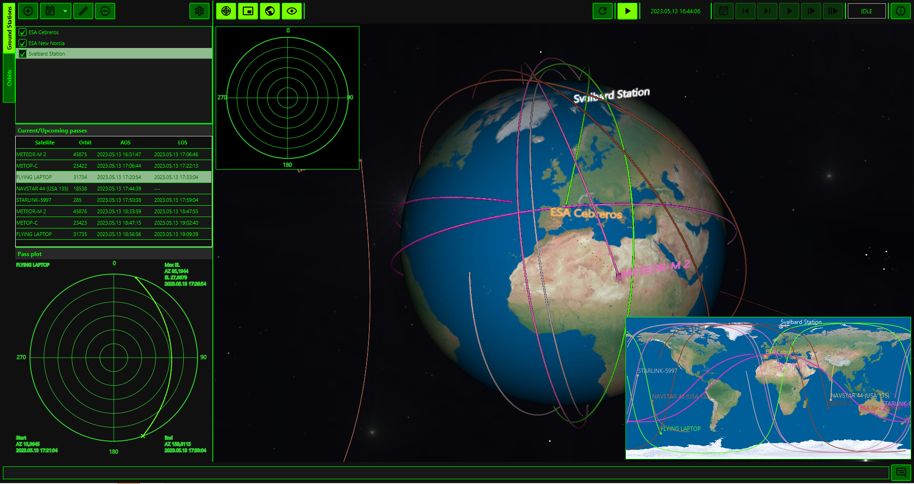

# Dr. Orbiteex

Dr. Orbiteex is a Java application that leverages the functionalities provided 
by the Orekit library (https://www.orekit.org/) to provide a visual orbit 
visualisation platform.
Dr. Orbiteex allows you to:
- Define the location of your ground stations/points of interest on Earth
- Import orbital data in the form of TLE (https://en.wikipedia.org/wiki/Two-line_element_set) or CCSDS OEM files (https://public.ccsds.org/Pubs/502x0b2c1e2.pdf), with a direct import
function from the Celestrak TLE website (https://celestrak.org/NORAD/elements/)
- Show the path of each orbit on a 3D view and a 2D view and the current location of each 
satellite
- Show the visibility windows over the defined ground stations/points of interest
- Show the visibility circles from the defined ground stations by selecting an orbit of 
interest
- Show the tracking data (azimuth/elevation) related to a visibility window
- Export a TLE-based orbit to CCSDS OEM file (KVN and XML)
- For a ground station/point of interest, export a set of visibility windows in the form of
CCSDS Simple Schedule file (https://public.ccsds.org/Pubs/902x1b1c1.pdf)

## Getting started
Make sure you have Java >= 11 and Apache Maven installed.

In order to have Dr. Orbiteex up and running from scratch, run the following steps:
1. Download the Orekit Data from https://gitlab.orekit.org/orekit/orekit-data/-/archive/master/orekit-data-master.zip
2. Extract the contents
3. Rename the extracted folder from "orekit-data-master" to "orekit-data"
4. Create a folder named "drorbiteex" inside your home folder (e.g. "C:\Users\<your username>\drorbiteex" on Windows or "/home/<your username>/drorbiteex" on Linux)
5. Copy the "orekit-data" folder inside the "drorbiteex" folder created in step 4
6. Clone Dr. Orbiteex from GitHub and checkout the master branch
7. Perform a "mvn clean install" from the fetched version
8. In the "target" folder, a zip file will be generated
9. Decompress the zip file anywhere on your filesystem, and run the start.bat (Windows) or start.sh (Linux) inside
