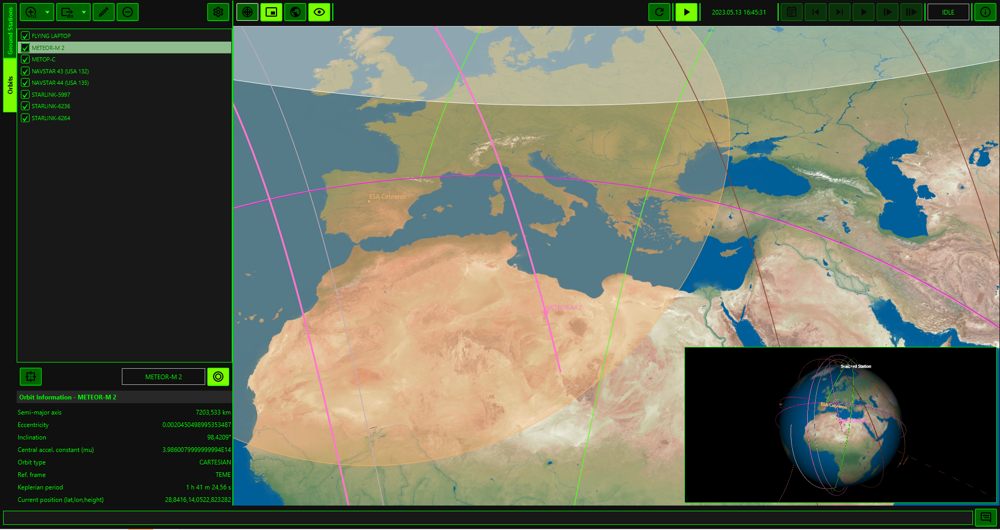
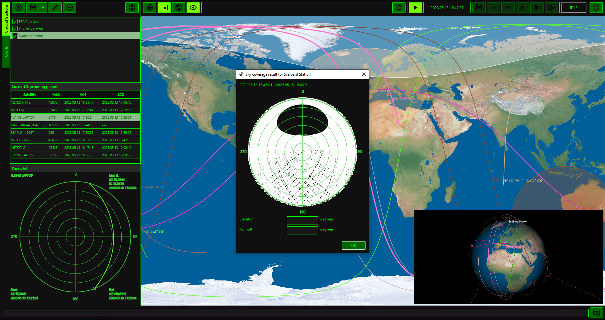

# Dr. Orbiteex

Dr. Orbiteex is a Java application that leverages the functionalities provided 
by the Orekit library (https://www.orekit.org/) to provide a visual orbit 
visualisation platform.
Dr. Orbiteex allows you to:
- Define the location of your ground stations/points of interest on Earth
- Import orbital data in the form of TLE (https://en.wikipedia.org/wiki/Two-line_element_set) or CCSDS OEM files (https://public.ccsds.org/Pubs/502x0b2c1e2.pdf), with a direct import
function from the Celestrak TLE website (https://celestrak.org/NORAD/elements/)
- Show the path of each orbit on a 3D view and a 2D view and the current/specified location of each 
satellite
- Show the visibility windows over the defined ground stations/points of interest, export such data as CSV
- Show the visibility circles from the defined ground stations by selecting an orbit of 
interest
- Show the tracking data (azimuth/elevation) related to a visibility window, export such data as CSV
- Export a TLE-based orbit to CCSDS OEM file (KVN and XML)
- For a ground station/point of interest, export a set of visibility windows in the form of
CCSDS Simple Schedule file (https://public.ccsds.org/Pubs/902x1b1c1.pdf)
- Detect collinearity events with reference to a specific satellite/orbit
- Calculate sky coverage maps for a given ground station/point of interest, with reference to a selectable set of satellites/orbits
- Compute position/velocity error among two or more orbits
- Compute elevation/azimuth/angular error between a reference orbit and other orbits with respect to a reference ground station
- Compute orbit determination (using TLE propagator and numerical propagator) from a set of measurements (supported file formats: CCSDS TDM and CCSDS OEM).

## Getting started
Make sure you have Java >= 11 and Apache Maven installed.

In order to have Dr. Orbiteex up and running from scratch, run the following steps:
1. Download the Orekit Data from https://gitlab.orekit.org/orekit/orekit-data/-/archive/master/orekit-data-master.zip
2. Extract the contents
3. Rename the extracted folder from "orekit-data-master" to "orekit-data"
4. Create a folder named "drorbiteex" inside your home folder (e.g. "C:\Users\<your username>\drorbiteex" on Windows or "/home/<your username>/drorbiteex" on Linux)
5. Copy the "orekit-data" folder inside the "drorbiteex" folder created in step 4

Now, obtain the Dr. Orbiteex binaries:
1. Download the pre-compiled version from GitHub under Releases;
  
or:
1. Clone Dr. Orbiteex from GitHub and checkout the master branch or one of the branches you want to compile
2. Perform a "mvn clean install -Prelease" from the fetched version
3. In the "target" folder, zip and tar.gz files will be generated for Windows, Linux, Mac

Finally, decompress the zip/tar.gz file anywhere on your filesystem, and run the start.bat (Windows) or start.sh (Linux/Mac) inside

## Extensions
Dr. Orbiteex can export CCSDS OEM files and CCSDS Simple Schedule Files. There is a way to customise some aspects of this 
export process, by means of extensions. An extension is an implementation of a specific Dr. Orbiteex Java interface, to be
exposed to Dr. Orbiteex via the standard Java Module system.

### CCSDS OEM
Two interfaces can be implemented:

- IOemNameGenerator: if a target directory is selected, this extension allows to programmatically generate a name for the exported file. 
- IOemPostProcessor: the specific implementation will be called after the generation of the OEM file. 

In order to use the implementations, they must be announced in the module-info file of the corresponding module, e.g.:

- provides eu.dariolucia.drorbiteex.model.oem.IOemPostProcessor with [implementation];
- provides eu.dariolucia.drorbiteex.model.oem.IOemNameGenerator with [implementation];

### CCSDS Simple Schedule
Two interfaces can be implemented:

- IScheduleNameGenerator: if a target directory is selected, this extension allows to programmatically generate a name for the exported file.
- IScheduleExporter: the specific implementation during the export process. 

In order to use the implementations, they must be announced in the module-info file of the corresponding module, e.g.:

- provides eu.dariolucia.drorbiteex.model.schedule.IScheduleExporter with [implementation];
- provides eu.dariolucia.drorbiteex.model.schedule.IScheduleNameGenerator with [implementation];

### Appearance
If you want to run Dr. Orbiteex with the default style from OpenJFX, modify the launch script to append VM argument 
-Ddrorbiteex_css_default_theme to the java invocation.
